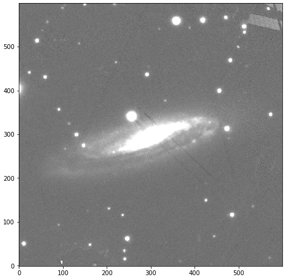

.. _cutouts_example:

Cutouts
=======

This module allows you to download image cutouts from :code:`PS1`, :code:`DES` and :code:`SDSS`. For this, the user can use :func:`download_images` and use the coordinates of an object:

.. code:: python

	from hostphot.cutouts import download_images

	download_images(name='SN2004eo', ra=308.22579, dec=9.92853, survey='PS1')

A new directory is created with the name ``name`` under the working directory (see :ref:`Working Directory <work_dir>`). The downloaded fits images will have the format ``<survey>_<filter>.fits``. If the filters are not specified, images in all the available filters (survey dependent) are downloaded.

Let's check the downloaded image.

.. code:: python

	import numpy as np
	import matplotlib.pyplot as plt
	from astropy.io import fits

	img = fits.open('images/SN2004eo/PS1_g.fits')

	data = img[0].data
	m, s = np.nanmean(data), np.nanstd(data)

	fig, ax = plt.subplots(figsize=(8, 8))
	im = ax.imshow(data, interpolation='nearest',
		       cmap='gray',
		       vmin=m-s, vmax=m+s,
		       origin='lower')
	plt.show()

