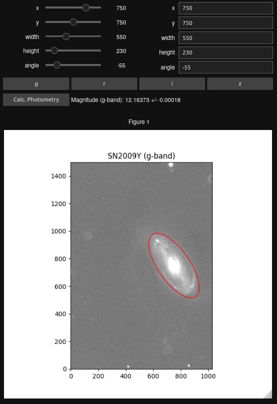

.. _inter_ap:

Interactive Aperture
====================

HostPhot also allows the user to interactively set the aperture used for photometry (available with jupyter notebooks only):

.. code:: python

	%matplotlib widget
	from hostphot.interactive_aperture import InteractiveAperture

	obj = InteractiveAperture('SN2009Y')

The user can change the parameters of the ellipse by using the sliders (top left) or the boxes (top right), change between filters by clicking on the horizontal buttons and calculate the photometry by clicking on the ``Calc. Photometry`` button. Note that the ellipse can also be centred by clicking on the image.

The calculated photometry can then be accessed directly from the created obeject or exported into a ``csv`` file:

.. code:: python

	obj.export_photometry()
