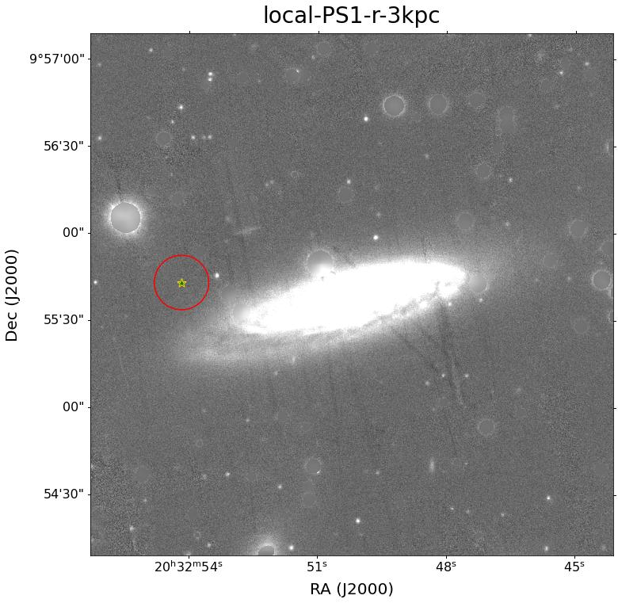
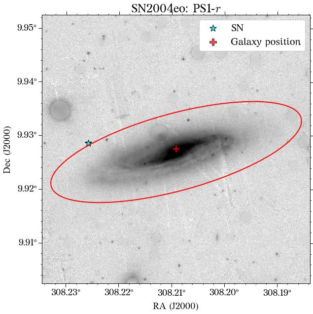

.. _photometry_example:

Photometry
==========

HostPhot can calculate the photometry of the entire galaxy (global) or in a given circular aperture (local). For this, the code heavily relies on `astropy` and `photutils`.

Local Photometry
~~~~~~~~~~~~~~~~

Local photometry can be obtained for the downloaded images. For this, a circular aperture is used (multiple apertures can be set), assuming a cosmology (``H0=70`` and ``Om0=0.3`` by default; hence a redshift is needed):

.. code:: python

	import hostphot.local_photometry as lp

	ap_radii = [3, 4]  # aperture radii in units of kpc
	ra, dec =  308.22579, 9.92853 # coords of SN2004eo
	z = 0.0157  # redshift

	results = lp.multi_band_phot(name, ra, dec, z,
                             	survey=survey, ap_radii=ap_radii, 
                             	use_mask=True, correct_extinction=True,
                             	save_plots=True)

``results`` is a dictionary with the photometry (magnitudes) of the filters used. Note that the coordinates are at the position of the object (``SN2004eo``). The cosmology can be changed with :func:`lp.choose_cosmology()`. Setting ``use_mask=True`` tells HostPhot to used the masked images previously created (see :ref:`Image Pre-processing <preprocessing>`) and setting ``save_plots=True`` provides output plots with the images and the apertures used, which are saved under the object's directory.

Image with local aperture:

The green star marks the position of the SN and the red circle the aperture used.

Global Photometry
~~~~~~~~~~~~~~~~~

Global photometry relies on `sep <https://github.com/kbarbary/sep/>`_ and uses `Kron fluxes`. It works in a relatively similar way to the local photometry:

.. code:: python

	import hostphot.global_photometry as gp

	results = gp.multi_band_phot(name, host_ra, host_dec, 
                             	survey=survey, ra=ra, dec=dec,
                             	use_mask=True, correct_extinction=True,
                             	common_aperture=True, coadd_filters='riz', 
                             	save_plots=True)

Setting ``common_aperture=True`` tells HostPhot to used the same aperture for all the filters, obtained from the coadded image (``coadd_filters='riz'``; see :ref:`Image Pre-processing <preprocessing>`) and setting ``optimize_kronrad=True`` provides a more reliable aperture than using the default parameters commonly used by SExtractor as the aperture is increased until the change in flux is neglegible (this can be changed with ``eps``). The rest of the parameters are the same as before.

Image with global aperture:

The parameters ``ra`` and ``dec`` are only used to plot the position of the SN. By default, HostPhot corrects for Milky Way extinction using the recalibrated dust maps
by Schlafly & Finkbeiner (2011) and the extinction law from Fitzpatrick (1999).
