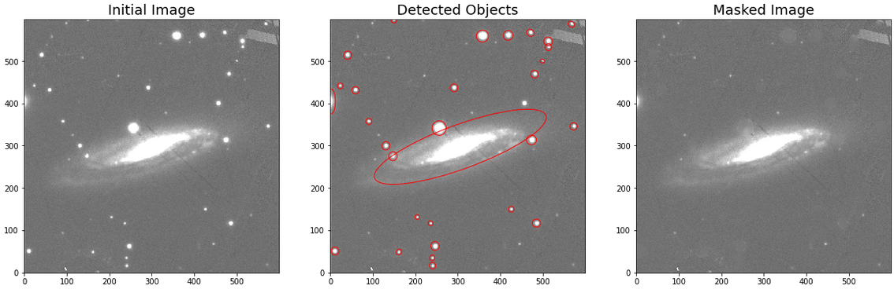

.. _preprocessing:

Image Pre-processing
====================

A set of pre-processing steps can be performed to ensure an accurate photometry calculation. Note that all the steps are performed following the structure given by the working directory (see :ref:`Working Directory <work_dir>`).

Coadding
~~~~~~~~

The user can perform image coadding in a single line:

.. code:: python

	from hostphot.coadd import coadd_images

	coadd_filters = 'riz'
	coadd_images(name, filters=coadd_filters, survey=survey)  # creates a new fits file

This creates a new fits image under the object's directory, in this case, with the name ``PS1_riz.fits``. Coadding images is useful for common aperture photometry (see below). For the coadd, HostPhot makes use of `reproject <https://reproject.readthedocs.io/en/stable/index.html>`_.

Image Masking
~~~~~~~~~~~~~

Some low-redshift galaxy can have foreground stars "sitting" on top of them. HostPhot can remove these first detecting them with pseudo-sigma clipping (using `sep <https://github.com/kbarbary/sep/>`_) and cross-matching the sources with a catalog of stars (using `astroquery MAST <https://astroquery.readthedocs.io/en/latest/mast/mast.html>`_), and then masking them using a 2D Gaussian kernel. The coadded image created above can be masked and the parameters of the mask can be extracted to be used on single filter images of the same object: 

.. code:: python

	from hostphot.image_masking import create_mask

	# one can extract the mask parameters from the coadd
	# this also creates new fits files
	coadd_mask_params = create_mask(name, host_ra, host_dec,
                                	filt=coadd_filters, survey=survey,
                                	extract_params=True, threshold=23)  

	for filt in 'grizy':
    		create_mask(name, host_ra, host_dec, filt, survey=survey,
                	    common_params=coadd_mask_params)

Note that the host-galaxy coordinates need to be provided so HostPhot knows which object not to mask out. The steps above create masked fits images, in this case, with the names ``masked_PS1_<filter>.fits``. See below an example of this mask applied:

If the user is not happy with the result of the masking, there are a few parameters that can be adjusted. For instance, ``threshold`` sets the threshold (how many sigmas above the background noise) used by ``sep`` for detecting objects. Lowering it will allow the detection of fainter objects. ``sigma`` is the width of the gaussian used for convolving the image and masking the detected objects. If ``crossmatch`` is set to ``True``, the detected objects are cross-matched with the Gaia catalog and only those in common are kept. This is useful for very nearby host galaxies (e.g. that of SN 2011fe) so the structures of the galaxy are not maked out, artificially lowering its flux. Note that the images can be background subtracted by setting ``bkg_sub=True``, although this is only needed for ``2MASS``, ``WISE`` and ``VISTA`` images only. Also note that the mask parameters are saved into a pickle file by default.
