.. _information_cutouts:

Cutouts
=======

The images are downloaded from different sources depending on what was the easiest at the moment of adding the survey.

PS1
~~~

These images are downloaded from the PS1 server directly. The code found at the end of the `PS1 Image Cutout Service <https://outerspace.stsci.edu/display/PANSTARRS/PS1+Image+Cutout+Service#PS1ImageCutoutService-ImportantFITSimageformat,WCS,andflux-scalingnotes>`_ was adapted for HostPhot. The pixel scaling of the images is 0.25 arcsec/pixel, as described in the `PS1 website <https://outerspace.stsci.edu/display/PANSTARRS/PS1+Image+Cutout+Service#PS1ImageCutoutService-ImportantFITSimageformat,WCS,andflux-scalingnotes>`_. The available filters are: :math:`grizy`.

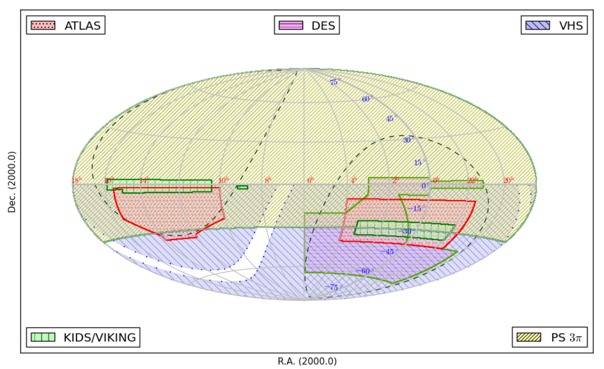

  PS1 survey footprint. Image from `https://arxiv.org/pdf/1507.07694.pdf <https://arxiv.org/pdf/1507.07694.pdf>`_.

DES
~~~

DES images are downloaded from the `NOAO DataLab <https://datalab.noirlab.edu/sia.php>`_ using the Simple Image Access (SIA) service. Here is an `example notebook <https://github.com/astro-datalab/notebooks-latest/blob/master/04_HowTos/SiaService/How_to_use_the_Simple_Image_Access_service.ipynb>`_. The pixel scaling of the images is 0.263 arcsec/pixel, as described in the `DES website <https://des.ncsa.illinois.edu/releases/dr1/dr1-docs/acquisition>`_. The available filters are: :math:`grizY`.

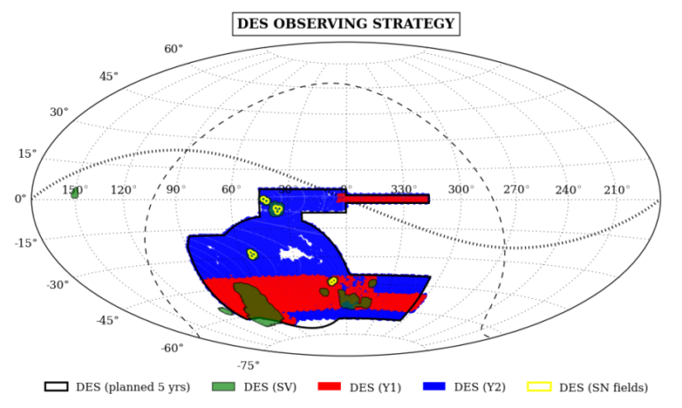

  DES survey footprint. Image from `https://www.darkenergysurvey.org/es/el-cartografiado/ <https://www.darkenergysurvey.org/es/el-cartografiado/>`_.

Note that DES images are flipped with respect to most other surveys.

SDSS
~~~~

These images are downloaded using `astroquery.skyview <https://astroquery.readthedocs.io/en/latest/skyview/skyview.html>`_. The `astroquery.sdss <https://astroquery.readthedocs.io/en/latest/sdss/sdss.html>`_ module is not used as it downloads much larger images (taking longer to download) and thus need to be trimmed. The pixel scaling of the images is 0.396 arcsec/pixel, as described in the `SDSS website <https://www.sdss.org/dr12/imaging/images/>`_. **Note:** it is recommended to use PS1 instead of SDSS as PS1 covers the same patch of the sky as SDSS and more (unless :math:`u`-band is needed). Also, PS1 is better calibrated and goes deeper. The available filters are: :math:`ugriz`. Data release 17 is the latest available version for imaging. 

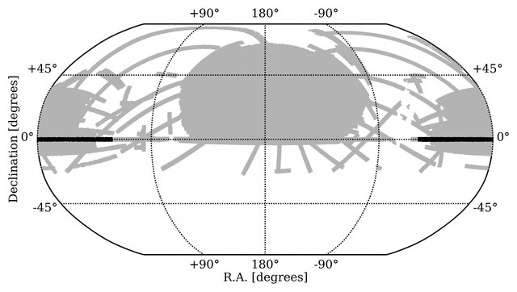

  SDSS survey footprint (data release 12). Image from `<https://ui.adsabs.harvard.edu/abs/2015arXiv151008075P/abstract>`_. Note that the SDSS imaging footprint has had virutally no changes in the last several data releases.
  
Note that SDSS images are rotated with respect to most other surveys.
  
GALEX
~~~~~

These are downloaded with `astroquery.mast.Observations <https://astroquery.readthedocs.io/en/latest/mast/mast.html>`_. The pixel scaling of the images is 1.5 arcsec/pixel, as described in the `GALEX website <https://asd.gsfc.nasa.gov/archive/galex/FAQ/counts_background.html>`_. The available filters are: :math:`FUV` (far-UV) and :math:`NUV` (near-UV). The user can choose between different surveys: Deep (DIS), Medium (MIS) or All-Sky Imaging Survey (AIS), Nearby Galaxy Survey (NGS) or Guest Investigator Survey (GII). By default, the image with the largest exposure time is downloaded.

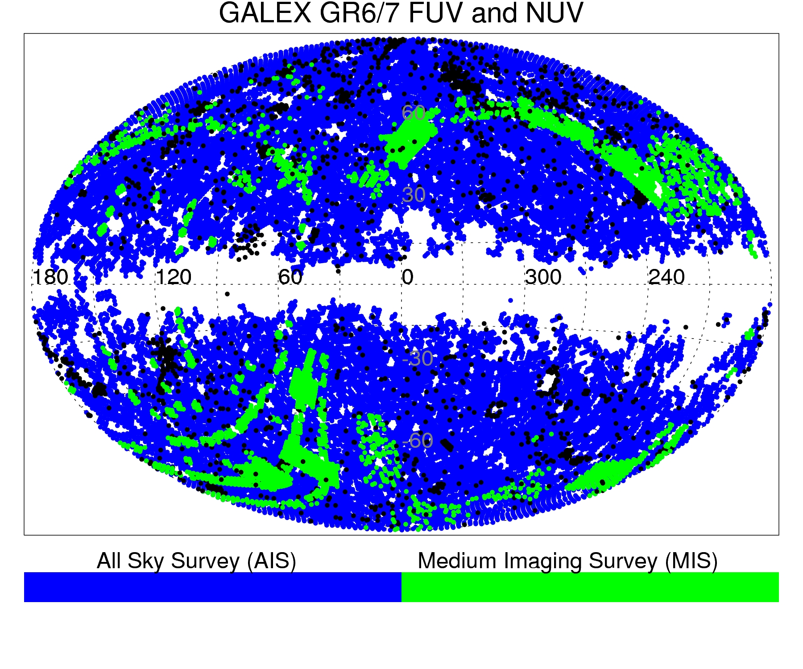

  GALEX survey footprint in galactic coordinates. Image from `https://archive.stsci.edu/missions-and-data/galex <https://archive.stsci.edu/missions-and-data/galex>`_.
  
  
2MASS
~~~~~

These images are downloaded from the 2MASS database following `https://irsa.ipac.caltech.edu/ibe/docs/twomass/allsky/allsky/#main <https://irsa.ipac.caltech.edu/ibe/docs/twomass/allsky/allsky/#main>`_. Information such as the `ordate` is first obtained from the last rows of the header of the images downloaded with `PyVo <https://pyvo.readthedocs.io/en/latest/>`_. However, the latter are not used as they are much larger and the 2MASS zero-points are missing in their headers. The pixel scaling of the images is 1.0 arcsec/pixel, as described in the `2MASS website <https://irsa.ipac.caltech.edu/Missions/2MASS/docs/sixdeg/>`_. The available filters are: :math:`J`, :math:`H` and :math:`K_{s}`.

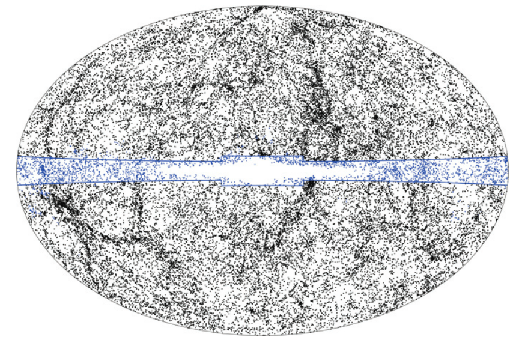

  2MASS survey footprint (:math:`K_s` band) in galactic coordinates. Image from `https://iopscience.iop.org/article/10.1088/0067-0049/199/2/26/pdf <https://iopscience.iop.org/article/10.1088/0067-0049/199/2/26/pdf>`_.
  
  
WISE
~~~~

These images are downloaded from the WISE database following `https://irsa.ipac.caltech.edu/ibe/docs/wise/allwise/p3am_cdd/#sample_code <https://irsa.ipac.caltech.edu/ibe/docs/wise/allwise/p3am_cdd/#sample_code>`_. Information such as the `coadd_id` is first obtained from the last rows of the header of the images downloaded with `astroquery.skyview`. However, the latter are not used as the 2MASS zero-points are missing in their headers. The pixel scaling of the images is 1.375 arcsec/pixel, as described in the `WISE website <https://wise2.ipac.caltech.edu/docs/release/prelim/>`_. The available filters are: :math:`W1` (:math:`3.4 \mu \text{m}`), :math:`W2` (:math:`4.6 \mu \text{m}`), :math:`W3` (:math:`12 \mu \text{m}`) and :math:`W4` (:math:`22 \mu \text{m}`).

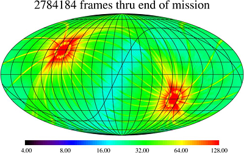

  WISE survey footprint in galactic coordinates. Image from `https://wise2.ipac.caltech.edu/docs/release/allwise/expsup/sec4_2.html#figure1 <https://wise2.ipac.caltech.edu/docs/release/allwise/expsup/sec4_2.html#figure1>`_.

unWISE
~~~~~~

unWISE is an unblurred coadd of the WISE imaging (i.e. better resolution). These images are directly obtained from the `unWISE image service <http://unwise.me/imgsearch/>`_. The pixel scaling of the images is 2.75 arcsec/pixel, as described in the website. The available filters are :math:`W1`, :math:`W2`, :math:`W3` and :math:`W4` for the AllWISE version, and only :math:`W1` and :math:`W2` for the NeoWISE-R1, NeoWISE-R2 and later versions (up to R7).

Legacy Survey
~~~~~~~~~~~~~

Legacy Survey images are downloaded following the under the "Obtaining Images and Raw Data" section in the `Legacy Survey website <https://www.legacysurvey.org/dr9/description/>`_. The pixel scaling of the images is 0.262 arcsec/pixel, as described in the website. The available filters are: :math:`grz`.

.. figure:: static/legacysurvey_footprint.png

  Legacy Survey survey footprint. Image from `https://www.legacysurvey.org/status/ <https://www.legacysurvey.org/status/>`_.
  
  
Spitzer
~~~~~~~

Spitzer images are taken only from the `SEIP survey <https://irsa.ipac.caltech.edu/data/SPITZER/Enhanced/SEIP/>`_ (other surveys might be included in the future), using the `IRSA IPAC cutouts service <https://irsa.ipac.caltech.edu/applications/Cutouts/docs/instructions.html>`_. The available filters are: IRAC.1 (:math:`3.6 \mu \text{m}`), IRAC.2 (:math:`4.5 \mu \text{m}`), IRAC.3 (:math:`5.8 \mu \text{m}`), IRAC.4 (:math:`8.0 \mu \text{m}`) and MIPS.1 (:math:`24 \mu \text{m}`), with pixel scalings of 0.6 and 2.45 arcsec/pixel, as described in the `IRAC manual <https://irsa.ipac.caltech.edu/data/SPITZER/docs/irac/iracinstrumenthandbook/IRAC_Instrument_Handbook.pdf>`_ (Section 4.10, for the mosaic images used) and `MIPS manual <https://irsa.ipac.caltech.edu/data/SPITZER/docs/mips/mipsinstrumenthandbook/MIPS_Instrument_Handbook.pdf>`_ (Table 4.9), respectively. This information is also found in the header of the images.

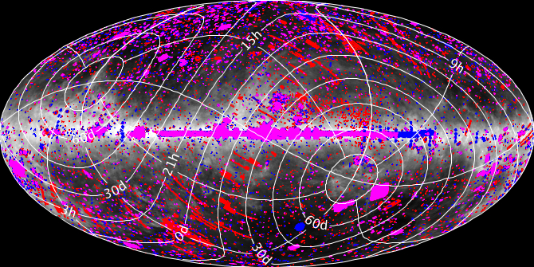

  Spitzer SEIP footprint. Image from the SEIP website.
  
  
VISTA
~~~~~

VISTA images are downloaded from the `VISTA science archive <http://horus.roe.ac.uk:8080/vdfs/VgetImage_form.jsp>`_. Three surveys are used: VHS (data release 6), VIDEO (data release 5) and VIKING (data release 4). The pixel scaling of the images is 0.339 arcsec/pixel, as described in the `VISTA website <https://vista.maths.qmul.ac.uk/>`_. The available filters are: :math:`ZYJHK_{s}` (survey dependent).

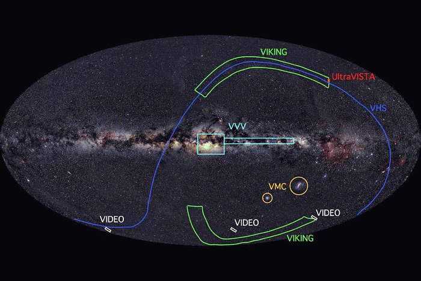
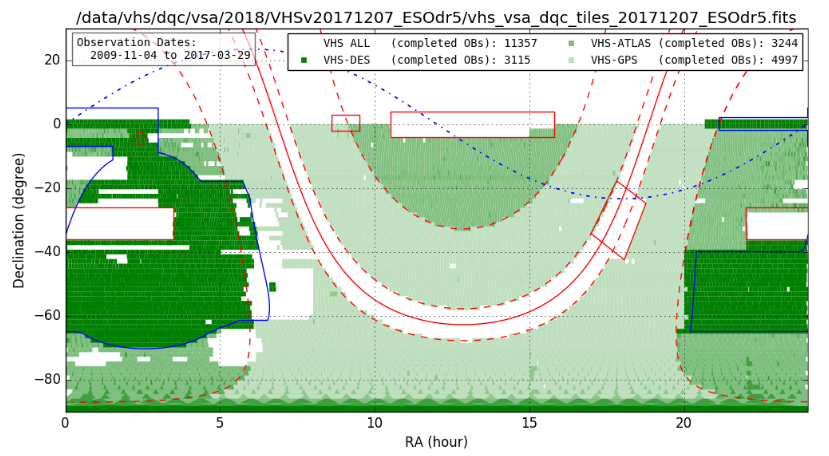

  VISTA surveys footprints. Images from `https://www.eso.org/public/images/allsky-vista/ <https://www.eso.org/public/images/allsky-vista/>`_ and `https://www.eso.org/rm/api/v1/public/releaseDescriptions/144 <https://www.eso.org/rm/api/v1/public/releaseDescriptions/144>`_.

Note that VISTA images are flipped with respect to most other surveys.

HST
~~~~~~~

These images are downloaded with `astroquery.esa.hubble <https://astroquery.readthedocs.io/en/latest/esa/hubble/hubble.html>`_, although it is recommened to download the images manually (e.g. through the MAST archive) as this is much faster and the user can choose among the different available images. These images can then be added into the workflow (see the Hubble example). The pixel scaling of the images is 0.04 and 0.13 arcsec/pixel for the UVIS and NIR channels, respectively, as described in the `ESA Hubble WFC3 website <https://esahubble.org/about/general/instruments/wfc3/>`_. All the filters are available for the given channels.

No survey footprint is provided as Hubble covers small patches of the sky.
  

SkyMapper
~~~~~~~~~

These images are downloaded from the NOAO DataLab using the SIA service (for more information, see the DES survey above). The pixel scaling of the images is 0.5 arcsec/pixel, as described in the `SkyMapper DR2 website <https://skymapper.anu.edu.au/data-release/>`_. The available filters are: :math:`uvgriz`.

.. figure:: static/skymapper_footprint.png

  SkyMapper survey footprint. Image from the SkyMapper DR2 website as well.

SPLUS
~~~~~

These images are downloaded from the NOAO DataLab using the SIA service (for more information, see the DES survey above). The pixel scaling of the images is 0.55 arcsec/pixel, as described in the `S-PLUS website <https://www.splus.iag.usp.br/survey/>`_. The available filters are: :math:`F378, F395, F410, F430, F515, F660, F861, G, I, R, U, Z`.

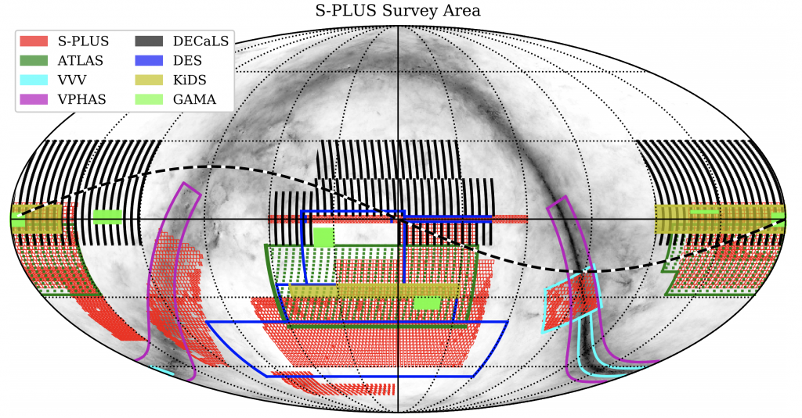

  S-PLUS survey footprint. Image from the S-PLUS website as well.

UKIDSS
~~~~~~

These images are downloaded from the VISTA science archive (for more information, see the VISTA link above). The pixel scaling of the images is 0.4 arcsec/pixel, as described in the `CASU WFCAM website <http://casu.ast.cam.ac.uk/surveys-projects/wfcam>`_. The available filters are: :math:`ZYJHK`. Multiple surveys are included in UKIDSS, which mainly cover different parts of the sky: Large Area Survey (LAS), Galactic Plane Survey (GPS), Galactic Clusters Survey (GCS),	Deep Extragalactic Survey (DXS) and  	Ultra Deep Survey (UDS). 

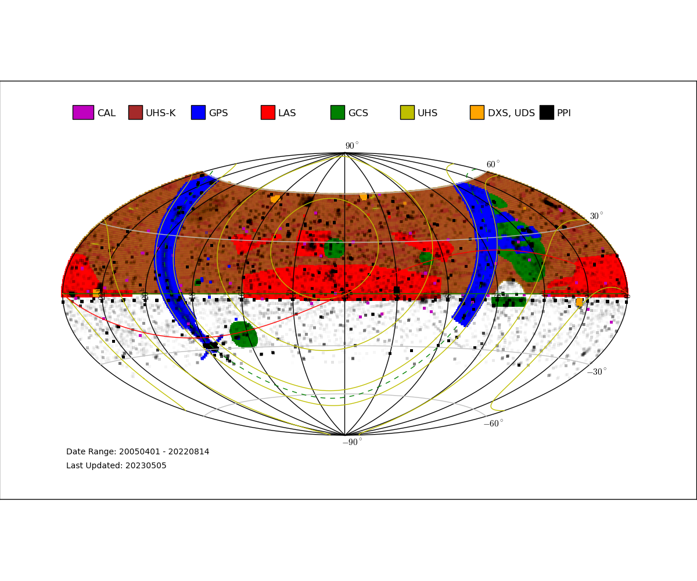

  UKIDSS survey footprint. Image from the `CASU WFCAM Survey Progress and QC website <http://casu.ast.cam.ac.uk/wfcamsp/overview>`_.

Note that UKIDSS images are flipped with respect to most other surveys.